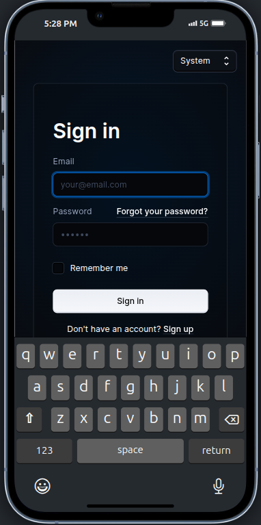
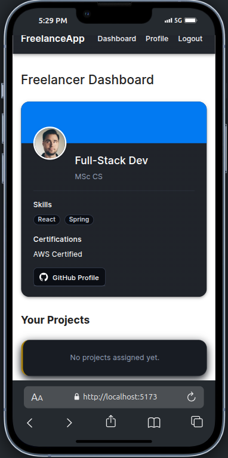
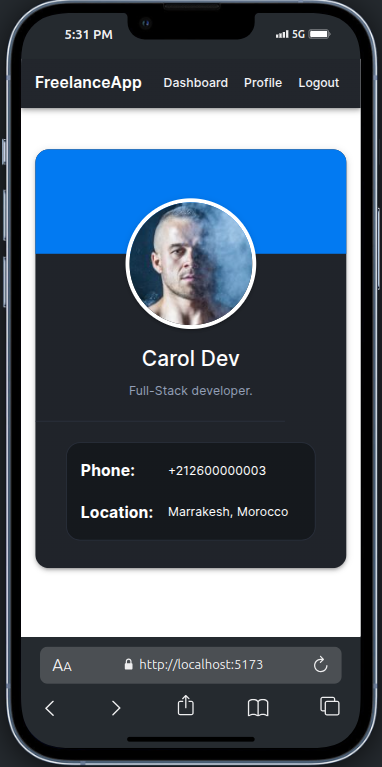

# Sooqtalent - React Application
for freelancers and clients to connect and collaborate effectively.

## Features
- User authentication with protected routes
- Dashboard layout with navigation
- Responsive Material UI components
- Custom theme with light/dark mode support
- Profile management

## Getting Started

### Prerequisites
- Node.js (v14 or higher)
- npm or yarn

### Installation
1. Clone the repository
2. Install dependencies

```bash
npm install
# or
yarn install
```
3. Start the development server
```bash
npm start
# or
yarn start
```

## Project Structure
- `/src/pages/` - Main application pages
- `/src/routes/` - Routing configuration including PrivateRoute component
- `/src/shared-theme/` - Material UI theme customizations
- `/src/components/` - Reusable React components

## Technologies
- React
- React Router
- Material UI
- TypeScript





